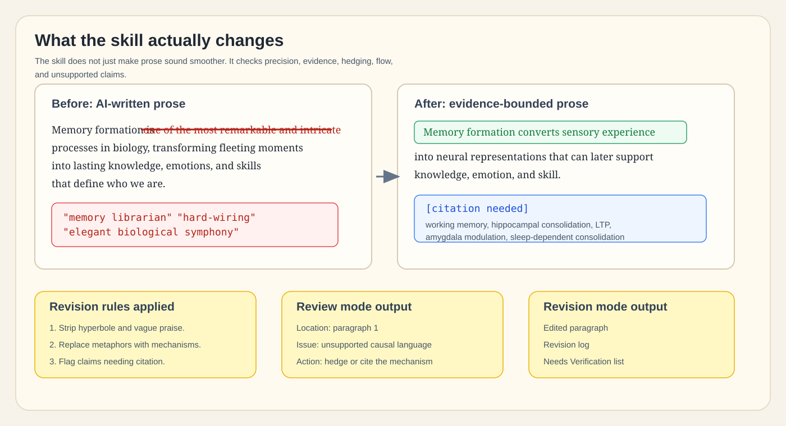

# manuscript-writing


`manuscript-writing` is an installable `SKILL.md` skill for revising and reviewing scientific, technical, and academic writing.

A few years ago, dissertation polishing meant a committee comment, a reference manager, and a 2 a.m. argument with Track Changes. This repo gives Claude, Codex, and OpenClaw a stricter manuscript checklist so they stop majoring in "sounds academic" and start dressing their claims in evidence, boundaries, and citations.

## What It Does

This skill has two modes:

- `revision`: edits the manuscript or supplied text directly.
- `review`: lists actionable suggestions without editing the source document.

Both modes read `references/revision-checklist.md` before acting and follow the checklist sequentially. The skill uses verified facts only and flags unavailable evidence under `Needs Verification`.

## Install

### Codex

```bash
git clone https://github.com/YSLAB-ai/manuscript-writing.git "${CODEX_HOME:-$HOME/.codex}/skills/manuscript-writing"
```

Restart Codex after installing.

### Claude Code

Personal skill:

```bash
git clone https://github.com/YSLAB-ai/manuscript-writing.git ~/.claude/skills/manuscript-writing
```

Project skill:

```bash
git clone https://github.com/YSLAB-ai/manuscript-writing.git .claude/skills/manuscript-writing
```

Claude Code can invoke skills directly with `/skill-name`, and personal skills live under `~/.claude/skills/<skill-name>/SKILL.md`. See the [Claude Code skills documentation](https://code.claude.com/docs/en/skills).

### OpenClaw

Global skill:

```bash
git clone https://github.com/YSLAB-ai/manuscript-writing.git ~/.openclaw/skills/manuscript-writing
openclaw skills check
```

Workspace skill:

```bash
git clone https://github.com/YSLAB-ai/manuscript-writing.git skills/manuscript-writing
openclaw skills check
```

OpenClaw loads skills from directories containing `SKILL.md`, including `~/.openclaw/skills/<skill-name>/SKILL.md` and `<workspace>/skills/<skill-name>/SKILL.md`. See the [OpenClaw skills documentation](https://openclawcn.com/en/docs/agent/skills/).

## Use

### Revision Mode

Use this when you want the document edited.

```text
Use $manuscript-writing in revision mode on this manuscript section.
Edit the text directly, preserve technical meaning, and return a revision log plus any Needs Verification items.
```

For Claude Code:

```text
/manuscript-writing revision mode: edit this paragraph for academic precision and concision.
```

### Review Mode

Use this when you want comments only.

```text
Use $manuscript-writing in review mode on this draft.
Do not edit the document. List issues, why they matter, and specific suggested actions.
```

For Claude Code:

```text
/manuscript-writing review mode: critique this introduction without editing it.
```

## Example

The before text below is a user-provided example of AI-written prose. The after text demonstrates the skill's editing style; factual claims still need source verification before manuscript use.



### Before

> Memory formation in the human brain is one of the most remarkable and intricate processes in biology, transforming fleeting moments of experience into lasting knowledge, emotions, and skills that define who we are. It begins the instant we perceive the world through our senses--sights, sounds, smells, and touches are rapidly converted into electrical and chemical signals that travel along neural pathways. These signals first enter short-term or working memory, a temporary "holding area" supported by the prefrontal cortex. For information to endure, it must undergo encoding and consolidation, a process heavily orchestrated by the hippocampus, which acts as a kind of "memory librarian," indexing new experiences and linking them to existing knowledge.
>
> At the cellular level, memory formation relies on synaptic plasticity--the brain's ability to strengthen or weaken connections between neurons. When we repeat an experience or pay close attention to it, synapses fire more efficiently through a mechanism called long-term potentiation (LTP), essentially "hard-wiring" the memory into neural circuits. Emotional events receive extra reinforcement from the amygdala, which is why we vividly remember where we were during major life moments. Over hours and days (especially during deep sleep), these fragile traces are stabilized and distributed across the cortex for long-term storage.
>
> In short, every memory we form is the result of billions of neurons communicating, adapting, and reorganizing themselves--an elegant biological symphony that turns the chaos of daily life into the coherent story of our lives.

### Tracked-Change Style Excerpt

> Memory formation in the human brain is <del>one of the most remarkable and intricate processes in biology</del> <ins>a multi-scale process</ins>, transforming <del>fleeting moments of experience into lasting knowledge, emotions, and skills that define who we are</del> <ins>sensory experience into neural representations that can later support knowledge, emotion, and skill</ins>.

| Change | Why |
| --- | --- |
| Removed "remarkable", "intricate", and "elegant biological symphony" | Strips hyperbole and metaphor-heavy prose. |
| Replaced "memory librarian" and "hard-wiring" | Uses mechanistic language instead of informal analogy. |
| Softened "which is why" and "proves" style causality | Avoids overstating mechanism without cited evidence. |
| Removed "billions of neurons" | Avoids an unsupported numerical magnitude. |
| Added boundary language | Makes clear that claims need citation and context. |

### After

> Memory formation converts sensory experience into neural representations that can later support knowledge, emotion, and skill. Sensory inputs are encoded as electrochemical neural activity and can be maintained briefly in working memory, with the prefrontal cortex contributing to short-term maintenance. Longer-lasting memories require encoding and consolidation. The hippocampus supports consolidation by linking new experiences with existing representations.
>
> At the cellular level, memory formation depends on synaptic plasticity, the activity-dependent strengthening or weakening of connections between neurons. Repeated or salient activity can increase synaptic efficacy through mechanisms such as long-term potentiation (LTP). Emotional salience can modulate consolidation through the amygdala, which may contribute to stronger recall of emotionally significant events. Over hours to days, including during sleep-dependent consolidation, initially labile traces can become more stable and distributed across cortical networks.
>
> Thus, memory formation is not a single event but a multi-scale process spanning sensory encoding, synaptic modification, systems-level consolidation, and later retrieval. This framing replaces metaphor-heavy prose with mechanisms that can be cited, tested, and bounded by evidence.

### Needs Verification

- Add citations for the roles of working memory, the prefrontal cortex, hippocampal consolidation, synaptic plasticity, LTP, amygdala modulation, and sleep-dependent consolidation.
- Verify whether the intended audience needs simplified definitions for LTP, consolidation, and cortical redistribution.
- Confirm whether the paragraph should remain general or be narrowed to a specific memory type, organism, method, or evidence base.

## Repository Layout

```text
SKILL.md
README.md
assets/hero.png
assets/demo-track-changes.svg
agents/openai.yaml
references/revision-checklist.md
```
